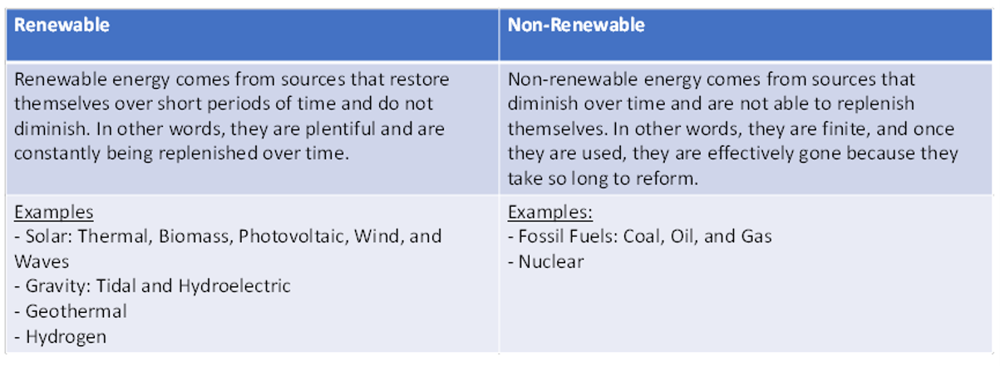

# energy

***

## key terms
* energy: energy is the capacity to do work. It is a scalar quantity.
    * the formula for energy is $$E=Pt$$
    * however, energy can also be measured in kilowatt*hours ($$kWh$$), which requires power and time measurements to be in kilowatts and hours to use the equation ($$E[kWh]=P[kW]×t[h]$$)
    * to convert from $$kWh$$ to $$J$$, multiply by $$3.6×10^6$$.
    * the SI unit for energy is the joule ($$J$$).
* work: work is done when a force acts on an object and displaces it. It is a vector quantity.
    * the formula for work is $$W=Fs$$
    * the SI unit for work is also the joule ($$J$$).
* power: power is the rate at which work is done or the rate at which energy is transferred or converted. It is a scalar quantity.
    * The formula for power is $$P=∆E/t$$
    * The SI unit for power is the watt (W).
* kinetic energy:
    * kinetic energy is the energy associated with the motion of an object.
    * the amount of kinetic energy depends on both the mass of the object and its velocity. 
    * types:
        * mechanical
        * thermal
        * electromagnetic
* potential energy:
    * potential energy is the energy that an object possesses due to its position, state, or condition.
    * it is stored energy that can be released when the object's position changes.
    * potential energy is associated with the potential to do work.
    * types:
        * gravitational
        * elastic
        * chemical
        * nuclear
* conservation of energy:
    * the conservation of energy is a fundamental principle that states energy cannot be created or destroyed; it can only change forms or be transferred.
* efficiency
    * efficiency is a measure of the amount of useful and wasted energy in an energy transfer
    * it can be calculated as a percentage by $$\eta=\frac{\text{useful output}}{\sum{\text{input}}}\times 100$$

## sources of energy
* 
* fossil fuels:
	* coal: coal is burned to produce heat, which is used to generate steam in power plants. the steam then drives turbines connected to generators, producing electricity.
	* oil: oil can be burned directly for heating or electricity generation. it is also a common fuel for internal combustion engines in vehicles.
	* gas: natural gas can be burned directly for heating or electricity generation. in power plants, it is often used to produce steam that drives turbines.

## turbines and generators:
* a lot of energy sources involve the use of a turbine and generator to produce electricity. this is an in-depth/step-by-step explanation as to how these technologies function:
	* **turbine design:** a turbine typically consists of a set of blades attached to a central rotor. the design of the turbine blades is crucial to efficiently capture the kinetic energy of the fluid.
	* **fluid flow:** the turbine is placed in the path of a flowing fluid, which can be water, steam, or wind, depending on the application. the fluid possesses kinetic energy due to its motion.
	* **impact on turbine blades:** as the fluid flows over the turbine blades, it imparts a force on them. the kinetic energy of the fluid is transferred to the turbine blades, causing them to move.
	* **rotor rotation:** the movement of the blades results in the rotation of the central rotor to which they are connected. the rotor is mounted on a shaft, and as it turns, it transfers mechanical energy to the shaft.
	* **generator connection:** the rotating shaft is connected to a generator. the mechanical energy from the rotating shaft is used to turn the generator's rotor.
	* **electromagnetic induction:** inside the generator, electromagnetic induction takes place. the rotating rotor, typically equipped with magnets or electromagnets, induces an electromotive force (EMF) in the stator windings.
	* **electricity generation:** the induced EMF produces an alternating current (AC) in the generator's windings. this AC can be further converted into direct current (DC) for transmission and distribution.
	* **powering electrical devices:** the generated electrical energy can then be used to power electrical devices, homes, or be fed into the electrical grid for broader distribution.