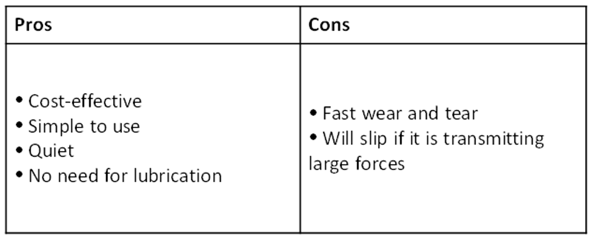
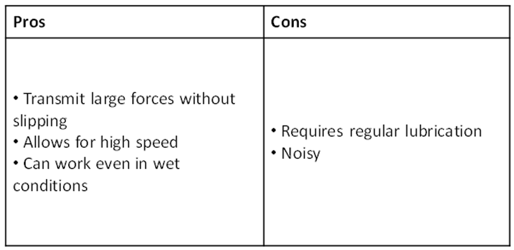
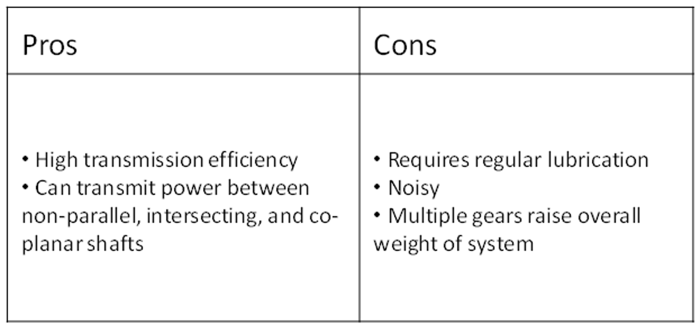
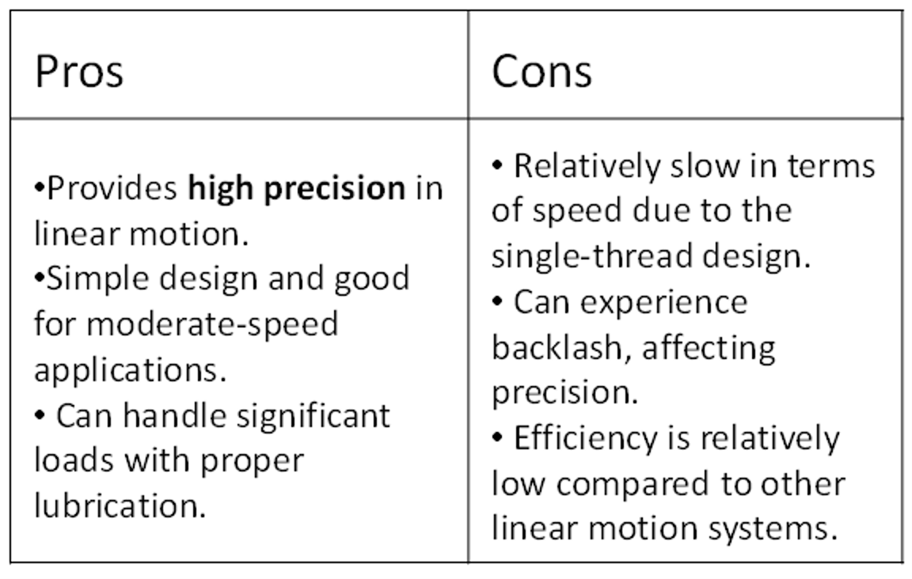
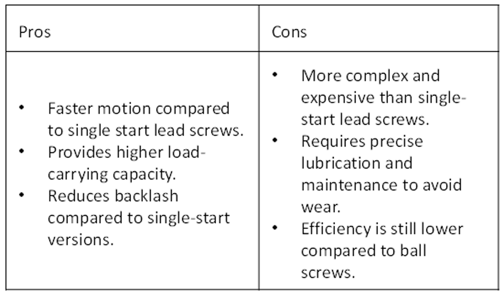
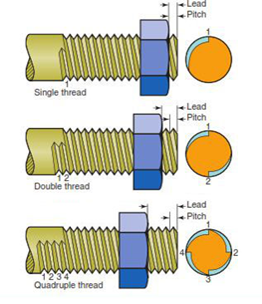

# types of mechanisms

***

#### pulley belt:
* the preferred model of power transmission over long distances.
* comprised of a looped strip from a flexible material that is used to link rotating disks.
* used to transmit power when shafts are far apart.
* direction of rotation of the driver and the follower are normally the same, but it is possible to have these rotating opposite directions if the drive belt is twisted.
* $$\text{VR}=\frac{∅_{follower}}{∅_{driver}}$$
* 

#### chain and sprocket:
* the preferred model of power transmission over medium distances.
* comprised of a system of chain links that connect via a set of sprockets. 
* sprockets are toothed wheels.
* $$\text{VR}=\frac{\text{teeth}_{follower}}{\text{teeth}_{driver}}$$ 
*  

#### rack and pinion:
* rotary motion can be converted into linear motion and vice versa.
* $$\text{distance}=\frac{\text{teeth}_{pinion} \text{revolutions}}{\text{teeth per metre}_{rack}}$$ 

#### gears:
* the most preferred model of power transmission over short distances. 
* comprised of gears that mesh with each other to transmit power.
* 

* **idler gear drive:**
	* if we add a third gear to the gear train, then the follower gear will rotate in the same direction as the driver gear.
	* this extra gear is called an idler gear.
	* the velocity ratio is not affected.
* **spur gears:**
	* the driven and follower gears rotate in opposite directions.
	* $$\text{VR}=\frac{\text{teeth}_{follower}}{\text{teeth}_{driver}}$$ 
* **worm gear and worm wheel:**
	* large increases in the velocity ratio are achieved with only two gears.
	* only the worm gear can be used to drive the system and not the worm wheel.
	* this system will lock into place when power is switched off.
	* $$\text{VR}=\text{teeth}_{worm wheel}$$
* **compound gear drive:**
	* compound gears are when two gears are joined together on the same shaft.
	* compound gear drives allow us to achieve very large increases in velocity ratio in a small amount of space.
	* $$\text{VR}=\frac{\text{teeth}_{follower1}}{\text{teeth}_{driver1}} \frac{\text{teeth}_{follower2}}{\text{teeth}_{driver2}} ...$$ 

#### lead screws:
* **single start:**
	* used in CNC machines and 3D printers to convert rotary motion into linear motion.
	* common in actuators for precise linear movement applications.
	* $$\text{distance}=\text{n}_{starts} \text{pitch} \text{revolutions}$$
	* 
* **multiple start:**
	* used in high*speed cnc machines and actuators where faster motion is needed compared to single start lead screws.
	* common in robotics and automated systems for quick linear displacement.
	* * $$\text{distance}=\text{n}_{starts} \text{pitch} \text{revolutions}$$
	* 
	* 